# Linux Web Server Lab

## Overview

This project demonstrates the deployment and configuration of a Linux web server using Apache, MySQL, DNS, and HTTPS on Ubuntu Server.

---

## Technologies

- Ubuntu Server
- Apache 2.4
- MySQL 8
- DNS
- HTTPS
- VirtualBox
- Linux CommandLine

---

# 1. Update the system

Update package repositories.

```bash
sudo apt update
sudo apt upgrade
```

### Screenshot

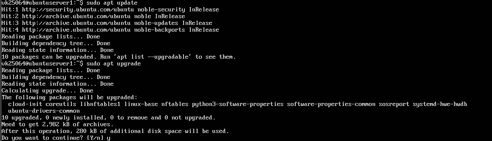

---

# 2. Install Apache

Install the Apache web server.

```bash
sudo apt install apache2
```

Verify installation.

```bash
apache2 -v
```

### Screenshot

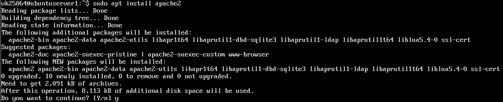

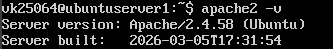

---

# 3. Verify HTTP

Find the server IP.

```bash
ip addr
```

Open the default Apache page.

```
http://SERVER_IP
```

### Screenshot

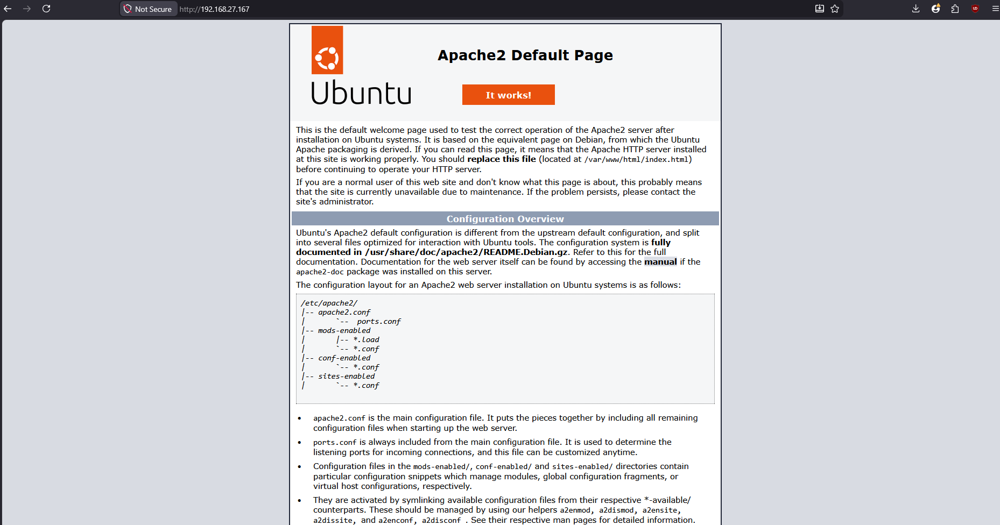

---

# 4. Configure HTTPS

Enable SSL.

```bash
sudo a2enmod ssl
sudo a2ensite default-ssl
sudo systemctl restart apache2
```

### Screenshot

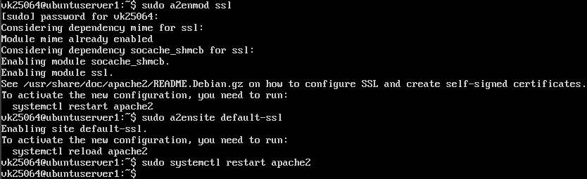

---

# 5. Install MySQL

```bash
sudo apt install mysql-server
```

Verify installation.

```bash
mysql --version
```

### Screenshot
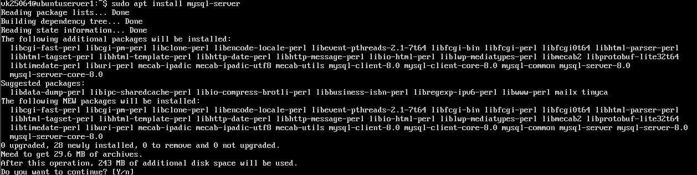
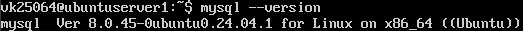

---

# 6. Configure Local DNS

Edit the hosts file.

```bash
sudo nano /etc/hosts
```

Add

```text
192.168.27.167 vk25064.local
```

Verify.

```bash
ping vk25064.local
```

### Screenshots

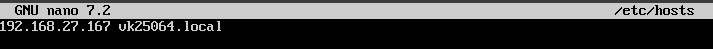

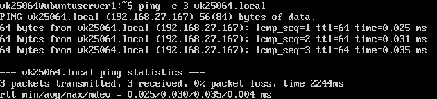

---

# 7. Create Website 1

Create the directory.

```bash
sudo mkdir /var/www/site1
```

Create index.html.

### Screenshot

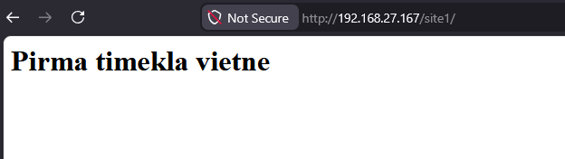

---

# 8. Benchmark Website 1

```bash
ab -n 1000 -c 10 http://192.168.27.167/site1/
```

### Screenshot

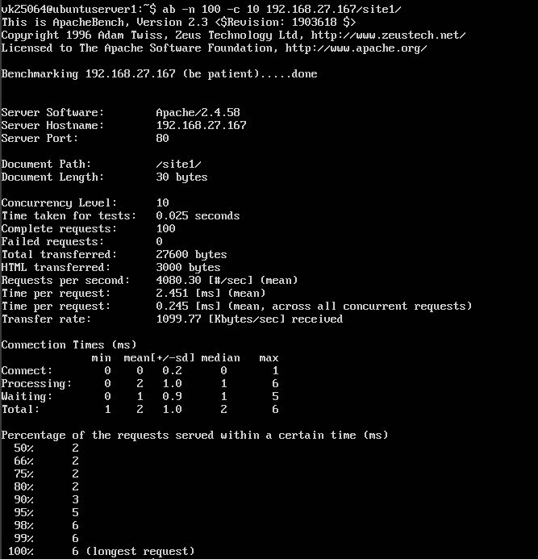

---

# 9. Create Website 2

Create

```bash
sudo mkdir /var/www/site2
```

Create another HTML page.

### Screenshot

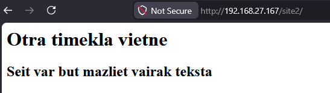

---

# 10. Benchmark Website 2

```bash
ab -n 1000 -c 10 http://192.168.27.167/site2/
```

### Screenshot

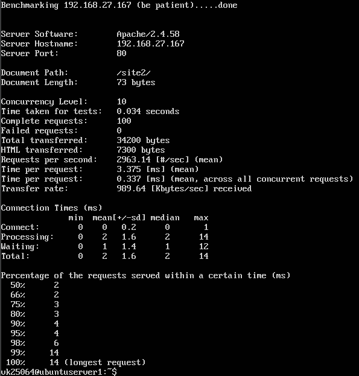

---

# Skills Demonstrated

- Linux Administration
- Apache Configuration
- HTTPS Configuration
- MySQL Installation
- DNS Configuration
- Apache Benchmark
- Linux CommandLine
